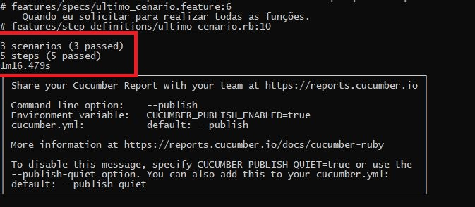
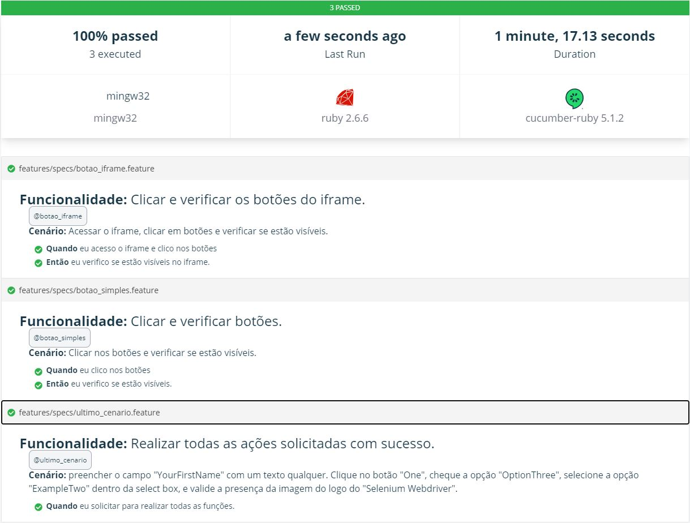

<h1 align='center'>WebJump!</h1><h3 align='center'>Teste - Analista QA (Ruby)</h3>
<div align='center'>
    
    
    
</div>
<div align='center'>
    
    
    
</div></br>

### Tópicos :scroll:
- Sobre o projeto
- Cenários de Teste
- Configurando o Ambiente
- Rodando os testes
- Gerando Relatórios
- Dificuldades
- Links


### Sobre o Projeto :book:

<p>
    &nbsp;&nbsp;&nbsp;&nbsp;&nbsp;&nbsp;O projeto teve como objetivo principal apresentar à empresa WebJump, meus conhecimentos em Testes de Software Automatizados.
</p>
<p>
    &nbsp;&nbsp;&nbsp;&nbsp;&nbsp;&nbsp;No entanto, com ele foi possível aprender e me desenvolver mais nessa área, principalmente, pois eu não possuía conhecimentos avancados na linguagem de programação Ruby e os frameworks (Cucumber e Capybara) utilizados nesse projeto.
</p>

### Cenários de Teste :cucumber:

&nbsp;&nbsp;&nbsp;&nbsp;&nbsp;&nbsp;Os cenários propostos pela WebJump, foram os listados a seguir:

```
1) Crie um cenário onde clicamos nos botões "One", "Two, e "Four", depois verifique a ausência dos mesmos.

2) Dentro da mesma página, clique nos botões "One", "Two" e "Four" que encontram-se dentro do painel "IFRAME BUTTONS" e valide a não-presença dos mesmos.

3) No cenário final, iremos preencher o campo "YourFirstName" com um texto qualquer. Clique no botão "One", cheque a opção "OptionThree", selecione a opção "ExampleTwo" dentro da select box, e valide a presença da imagem do logo do "Selenium Webdriver".
```


### Configurando o Ambiente :wrench:

&nbsp;&nbsp;&nbsp;&nbsp;&nbsp;&nbsp;Antes de tudo, será necessário realizar os seguintes downloads:
- [Ruby+Devkit](https://rubyinstaller.org/downloads/)
- [Chromewebdriver](https://chromedriver.chromium.org/downloads)
- Conteúdo deste repositório

&nbsp;&nbsp;&nbsp;&nbsp;&nbsp;&nbsp;Primeiramente, faça o download do Ruby e instale o seguindo seus passos de instalação.
&nbsp;&nbsp;&nbsp;&nbsp;&nbsp;&nbsp;Feito isso, será necessário realizar o download do chromewebdriver. O mesmo deverá ser movido para a pasta 'Windows' do seu disco local C.
&nbsp;&nbsp;&nbsp;&nbsp;&nbsp;&nbsp;Após realizado o download dos arquivos do repositório, para rodar os cenários de testes no **Windows**, será necessário seguir os seguintes passos:</br>

&nbsp;&nbsp;&nbsp;&nbsp;&nbsp;&nbsp;1- Digite o comando ```win``` + ```r```
&nbsp;&nbsp;&nbsp;&nbsp;&nbsp;&nbsp;2- Busque por ```cmd```
&nbsp;&nbsp;&nbsp;&nbsp;&nbsp;&nbsp;3- No prompt de comando, digite o seguinte comando: ```cd <local do arquivo - Acesse a pasta mãe>```
&nbsp;&nbsp;&nbsp;&nbsp;&nbsp;&nbsp;Ex: ```cd C:\Users\satos\Documents\Analista-QA-WebJump!```
&nbsp;&nbsp;&nbsp;&nbsp;&nbsp;&nbsp;Feito isso, será possível verificar que você está utilizando o cmd dentro da pasta que contém o programa e permitirá que você envie alguns comandos para a sua pasta atual.
&nbsp;&nbsp;&nbsp;&nbsp;&nbsp;&nbsp;4- Ainda no prompt de comando, envie o comando ```bundle install```.
&nbsp;&nbsp;&nbsp;&nbsp;&nbsp;&nbsp;Este comando será responsável por instalar todos os **resquisitos** para rodar os cenários de testes.

### Rodando os testes :arrow_forward:

&nbsp;&nbsp;&nbsp;&nbsp;&nbsp;&nbsp;Para rodar os testes, basta seguir até o passo 3 de configuração do ambiente e enviar o comando ```cucumber```.
&nbsp;&nbsp;&nbsp;&nbsp;&nbsp;&nbsp;Isso fará com que sejam executados todos os cenários de testes.
&nbsp;&nbsp;&nbsp;&nbsp;&nbsp;&nbsp;Caso haja a necessidade de rodá-los individulmente, basta enviar o comando acima e adicionar a tag do seu respectivo cenário.
&nbsp;&nbsp;&nbsp;&nbsp;&nbsp;&nbsp;```cucumber -t@botao_simples``` *(Cenário 1)*
&nbsp;&nbsp;&nbsp;&nbsp;&nbsp;&nbsp;```cucumber -t@botao_iframe``` *(Cenário 2)*
&nbsp;&nbsp;&nbsp;&nbsp;&nbsp;&nbsp;```cucumber -t@ultimo_cenario``` *(Cenário 3)*
&nbsp;&nbsp;&nbsp;&nbsp;&nbsp;&nbsp;O resultado dos testes será apresentado da seguinte forma:



### Gerando Relatórios :bar_chart:

&nbsp;&nbsp;&nbsp;&nbsp;&nbsp;&nbsp;Para gerar relatórios no padrão oficial do cucumber, basta rodar o teste com o comando ```cucumber --publish```, copiar o link apresentado após a finalização do teste e colá-lo no navegador de sua preferência. O mesmo será apresentado da seguinte maneira:



### Dificuldades :muscle:

&nbsp;&nbsp;&nbsp;&nbsp;&nbsp;&nbsp;Durante o desenvolvimento dos cenários de testes, verifiquei que quando as sentenças criadas para testes são iguais, as mesmas podem ocasionar um conflito no resultado dos testes, não sendo necessariamente erro na aplicação testada.
&nbsp;&nbsp;&nbsp;&nbsp;&nbsp;&nbsp;Outro problema encontrado, foi no detalhamento do xpath do iframe. Quando o mesmo foi declarado apenas como ```"//iframe"```, foi detectado no site, dois campos que continham iframes diferentes. Logo, para corrigir o problema, o iframe foi descrito para encontrar o campo esperado.


### Referências :link:

&nbsp;&nbsp;&nbsp;&nbsp;&nbsp;&nbsp;[Ruby Download]()
&nbsp;&nbsp;&nbsp;&nbsp;&nbsp;&nbsp;[Chromewebdriver]()
&nbsp;&nbsp;&nbsp;&nbsp;&nbsp;&nbsp;[Documentação do Capybara](https://rubydoc.info/github/jnicklas/capybara/master/Capybara/Node/Finders)
&nbsp;&nbsp;&nbsp;&nbsp;&nbsp;&nbsp;[Repositório do teste](https://github.com/HenriqueSaKi/Analista-QA-WebJump-Ruby)